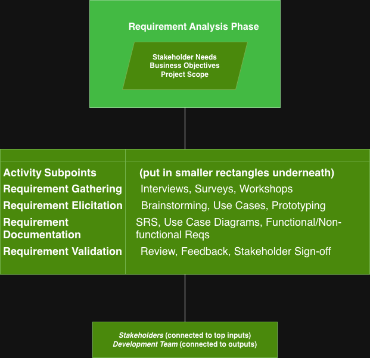

# requirement-analysis

# Requirement Analysis in Software Development

## What is Requirement Analysis?
Requirement Analysis is the process of identifying, understanding, and documenting the needs and expectations of stakeholders for a software system. It forms the foundation of the entire software development lifecycle (SDLC), ensuring that the final product meets both business objectives and user expectations.

The goal is to define **what** the system should do before determining **how** it will be implemented.

---

## Why is Requirement Analysis Important?
Requirement Analysis is crucial because it bridges the communication gap between stakeholders and developers. Proper requirement analysis ensures:
- The system solves the **right problem**.
- Reduces **rework** and **project delays**.
- Prevents **scope creep** and **misunderstandings**.
- Improves **software quality** and **user satisfaction**.
- Enables clear **project planning** and **accurate estimation**.

Without proper analysis, projects often fail due to unclear, incomplete, or misunderstood requirements.

---

## Key Activities in Requirement Analysis

### 1. Requirement Gathering
This involves collecting information from stakeholders, users, and customers to understand their needs. Techniques include interviews, questionnaires, brainstorming sessions, and reviewing existing systems.

### 2. Requirement Elicitation
Elicitation goes deeper than gathering — it focuses on discovering hidden needs and assumptions. It involves active collaboration, use of prototypes, and workshops to bring clarity to the system’s purpose.

### 3. Requirement Documentation
The collected requirements are formally recorded in a **Software Requirement Specification (SRS)** document. This serves as a reference for developers, testers, and project managers throughout the project lifecycle.

### 4. Requirement Analysis and Modeling
This step focuses on analyzing and refining requirements to ensure they are consistent, complete, and feasible. Models such as **use case diagrams**, **data flow diagrams (DFDs)**, and **ER diagrams** are created to visualize and validate requirements.

### 5. Requirement Validation
Validation ensures that all documented requirements accurately reflect stakeholder intentions. Reviews, walkthroughs, and prototyping are commonly used to verify that the requirements are correct and achievable.

---

## Types of Requirements

### 1. Functional Requirements
These define what the system should do — the specific behaviors, functions, and processes.  
**Examples:**
- The system must allow users to create and manage bookings.
- The system must send a confirmation email after payment.

### 2. Non-Functional Requirements
These specify the **quality attributes** and constraints of the system, such as performance, security, usability, and scalability.  
**Examples:**
- The system must handle up to 10,000 users simultaneously.
- The system must respond within 2 seconds for any user action.

---

## Use Case Diagrams

### What are Use Case Diagrams?
Use Case Diagrams visually represent the interaction between **users (actors)** and **system functionalities (use cases)**. They are a key part of requirement analysis and help stakeholders understand the system’s scope and user interactions at a glance.

### Benefits of Use Case Diagrams
- Clarify system boundaries and interactions.
- Simplify communication between developers and stakeholders.
- Help identify missing or redundant functionalities.
- Serve as a foundation for test case creation.

### Example: Booking Management System Use Case Diagram

**Actors:**
- Customer  
- Admin  
- Payment Gateway  

**Use Cases:**
- Browse Listings  
- Make a Booking  
- Manage Bookings  
- Checkout  
- Process Payment  
- Generate Reports  

Below is the visual representation of the use case diagram for the booking management system:

## alx-booking-uc.png
https://drive.google.com/file/d/1Dos2shScy6nJh-8EIneZdZoA94cQYOAZ/view?usp=sharing
https://drive.google.com/file/d/1xEhiHQjcE1n4jbG_8p28ZGhAOsVAzlgQ/view?usp=sharing

---

## Acceptance Criteria

### Importance of Acceptance Criteria
Acceptance Criteria define the **conditions that must be met** for a feature to be considered complete and acceptable by stakeholders.  
They ensure clarity, prevent misunderstandings, and serve as the basis for **user acceptance testing (UAT)**.  
Well-written acceptance criteria help developers understand the expected behavior and guide testers in verifying functionality.

### Example: Checkout Feature Acceptance Criteria

**Feature:** Checkout Functionality

| ID | Acceptance Criteria | Status |
|----|----------------------|---------|
| AC-01 | User must be able to review selected booking details before payment.
| AC-02 | The system must display total price, taxes, and discounts.
| AC-03 | Payment gateway must process transactions securely. 
| AC-04 | A confirmation email should be sent to the user after successful payment.
| AC-05 | If payment fails, user should see an appropriate error message and retry option. 

---

### Summary
Requirement Analysis serves as the **blueprint of software development**.  
By defining clear, validated, and well-documented requirements, teams can build systems that truly meet user and business needs — reducing risks and increasing project success rates.
